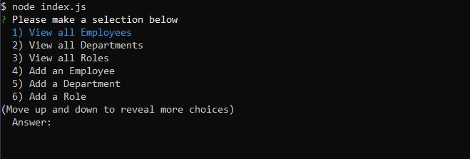
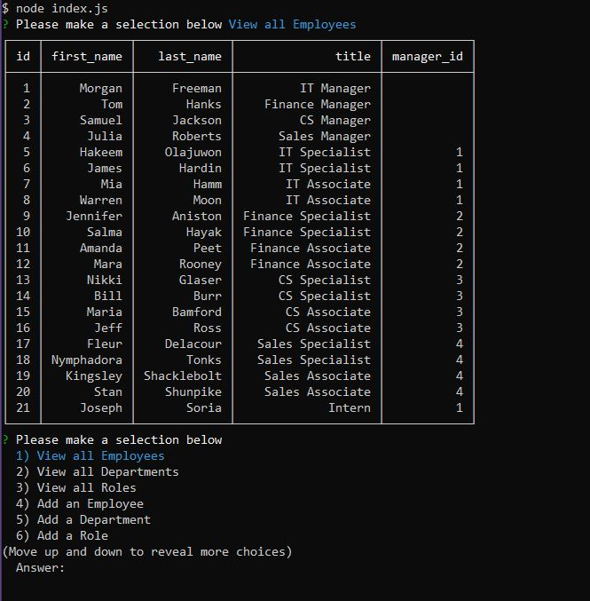
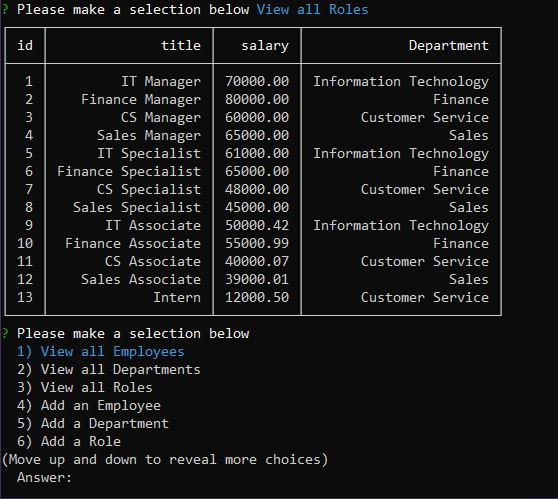
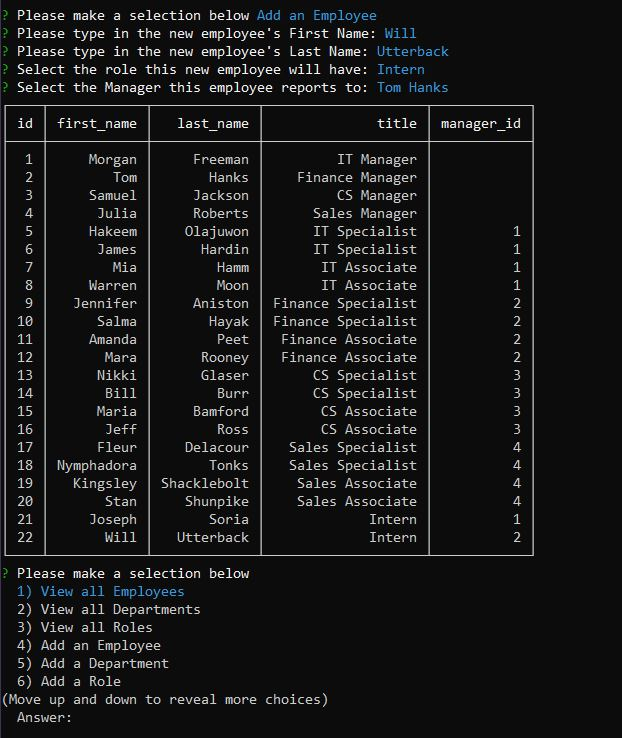

# CLI Employee Tracker

## Deployed site

https://mrllanes.github.io/Employee-Tracker/
https://github.com/mrllanes/Employee-Tracker
https://youtu.be/zr40MVsi5x0

## Table of Contents

-   [Description](#description)
-   [Installation](#installation)
-   [Usage](#usage)
-   [Technology](#technology)
-   [Contributions](#contributions)
-   [Questions](#questions)

## Description

The CLI Employee Tracker is a simple Node/command line application that will help you track your employees. You can view their employee information including ID, full name, department they work under, their title/role, who their manager is, and what their salary is. Additions can be made and changing information on the employees is also allowed.

## Installation Instructions

Download the files (or branch to the repo), run "npm install" in your local folder (where you downloaded these files) and you are ready to go. To launch the app, type "node index" and it starts up.

## Usage

Once you have launched the application, the first menu will ask you what you want to do (view employees, view departments, view roles, add empoyees, add department, add role, and update employee role). By selecting one of the "view" options, a table will show you the desired information. By selecting one of the "add" options, follow the prompts given to add the appropriate information. After you are done adding the new employee/department/role, the new updated table will be displayed.

## Technology Stack

The following technologies were used to create this site/application/software/project:
JS, jQuery, Node (inquirer, MySQL2, console-table-printer), MySQL

## Contributions

The following individuals contributed to the creation of this site/application/software/project:
Super Awesome support team and Incredibly Awesome Instructor/Facilitator.

## Questions

If you have questions or comments about this project, please feel free to contact me via e-mail:
llanesm@gmail.com

You can also find more of my projects on my GitHub page:
https://github.com/mrllanes

## Screenshots

Please see the images below to see how the CLI Employee Tracker App looks!

